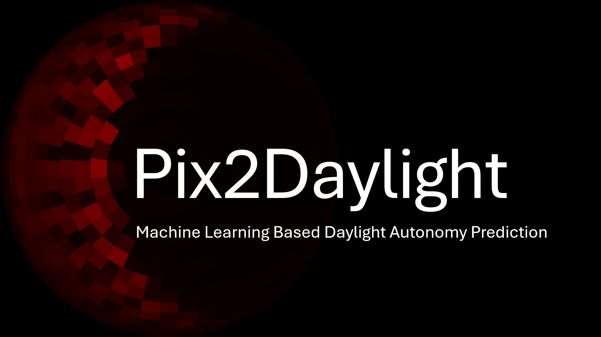
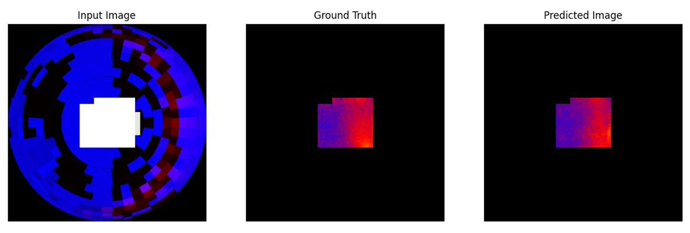

<!-- Improved compatibility of back to top link: See: https://github.com/GITHUBNAME/PROJECTNAME/pull/73 -->
<a name="readme-top"></a>

[![Contributors][contributors-shield]][contributors-url]
[![Forks][forks-shield]][forks-url]
[![Stargazers][stars-shield]][stars-url]
[![Issues][issues-shield]][issues-url]
[![MIT License][license-shield]][license-url]
[![LinkedIn][linkedin-shield]][linkedin-url]


<!-- PROJECT LOGO -->
<br />
<div align="center">
  <a href="https://github.com/iaac-macad/AIA24-studio-S-G03-DF_predictor">
    
  </a>

  <h3 align="center"> Pix2Daylight </h3>

  <p align="center" style="font-weight: bold;">
    IAAC: MaCAD Thesis 2023-24
    <br />
    <a href="https://colab.research.google.com/github/GITHUBNAME/PROJECTNAME/blob/main/src/NOTEBOOKNAME.ipynb">View Demo</a>
    ·
    <a href="https://github.com/GITHUBNAME/PROJECTNAME/issues">Report Bug</a>
    ·
    <a href="https://github.com/GITHUBNAME/PROJECTNAME/issues">Request Feature</a>
  </p>
</div>


<!-- TABLE OF CONTENTS -->
<details>
  <summary>Table of Contents</summary>
  <ol>
    <li>
      <a href="#about-the-project">About The Project</a>
      <ul>
      <li><a href="#intro">Intro</a></li>
        <li><a href="#built-with">Built With</a></li>
        <li><a href="#methodology">Methodology</a></li>
      </ul>
    </li>
    <li>
      <a href="#getting-started">Getting Started</a>
      <ul>
        <li><a href="#prerequisites">Prerequisites</a></li>
        <li><a href="#usage">Usage</a></li>
      </ul>
    </li>
    <li><a href="#challenges">Challenges</a></li>
    <li><a href="#future-work">Future work</a></li>
    <li><a href="#license">License</a></li>
    <li><a href="#contact">Contact</a></li>
    <li><a href="#team">Team</a></li>
    <ul>
        <li><a href="#supervisors">Supervisors</a></li>
      </ul>
    <li><a href="#acknowledgements">More acknowledgements</a></li>
  </ol>
</details>


<!-- ABOUT THE PROJECT -->
## About The Project



Project developed within the scope of MaCAD Thesis 2023-24 in [IAAC](https://iaac.net/).

__Description:__ Pix2Daylight aims to revolutionize daylight autonomy prediction in architectural design by developing a Pix2Pix machine learning model to predict daylight autonomy, with the location as an input variable from the user, motivated by the need to improve both efficiency and accuracy in daylight analysis.    \
 __Problem statement:__ Being part of the building codes in many countries throughout the whole world, daylight autonomy analysis is a long process due to the ray tracing simulations. However, it is an important part of the early design stages, where there are often iterations. \
 __Idea:__ Quick daylight autonomy analysis in Revit, via Rhino.Inside, responsive to changes in the model \
 __Solution:__ A Pix2Pix model is trained to provide daylight autonomy analysis in a very short time, applicable to any location with and EPW file, responsive to quick iterations on the design in Revit. \
 __Beneficiaries:__ The target users of "Pix2Daylight" are the companies who mainly use Revit for their projects, and who also uses Rhino.Inside. 


### Intro

Our project aims to revolutionize daylight prediction in architectural design by developing a Pix2Pix machine learning model to predict daylight autonomy. Motivated by the need of an ML model that is applicable to any location in the world, with an EPW file, our focus is providing immediate, actionable feedback. By integrating this model directly into Revit, architects can receive real-time predictions on daylight compliance, facilitating quicker and more informed design decisions. This approach not only enhances the design process but also ensures that buildings meet health, well-being, and regulatory standards.


<p align="right">(<a href="#readme-top">back to top</a>)</p>


### Built With


- [](https://www.python.org/)
- [](https://www.tensorflow.org/)
- [](https://code.visualstudio.com/)
- [](https://www.grasshopper3d.com/)
- [](https://www.rhino3d.com/)
- [](https://www.solemma.com/climatestudio)
- [](https://colab.research.google.com/)
- [](https://www.autodesk.com/products/revit/overview?term=1-YEAR&tab=subscription)
<p align="right">(<a href="#readme-top">back to top</a>)</p>


### Methodology


<!-- GETTING STARTED -->
## Getting Started

<a href="https://colab.research.google.com/drive/16uus1AyeYbzrpPk48UP5zc9no08RVxnj?usp=sharing" target="_parent"></a>\
alternatively clone the repo:
```
https://github.com/iaac-macad/Pix2Daylight.git
```


### Usage

To use the project follow these steps:
(assuming you have created an environment where you installed the requirements.txt on your computer)

* Step 1: (if you have your own dataset) Create input and groundtruth images of 256x256. Place them in trainxx (where xx is any strings you'd like), in dataset/input and dataset/groundtruth. Make sure the corresponding images have the same names. Using image_combining.ipynb, enter the train number and combine the images (png) locally on your computer.
* Step 1: (if you want to use our existing dataset) train10/dataset/archive.tar.gz is the combined and split verison of our dataset. If you want to use it, you can just proceed to the next step.
* Step 2: upload components folder, requirements.txt and train_save_test_model.ipynb in your google drive, all in the same folder.
* Step 3: upload the run_colab.ipynb file to your drive. you can run the script. The default hyperparameters are:
  {
    "TRAIN_NUMBER": "10",
    "BATCH_SIZE": 16,
    "EPOCH": 45,
    "LEARNING_RATE": 0.0002,
    "DISCRIMINATOR ": "v1",
    "GENERATOR": "v1"
}
but feel free to change and experience.

* Step 4: the generator model, predicted images and metrics are saved under the folder "trainxx" in your drive (the folder where you placed the files). If you would like to visualize the loss graph, you can go to the logs/fit folder that is created again in your parent folder, and download the event file belonging to that training. After you place the downloaded event file in your computer, where you cloned the repo, you can go to tensorboard_vis.ipynb and visualize thre graphs for generator, discriminator and total. 


<p align="right">(<a href="#readme-top">back to top</a>)</p>

## Challenges

While working on the project the following challenges were encountered:

* Running on CPU: the CPU was not enough to deal with the dataset. Running locally on GPU was not an option since not all users have newer GPUs. Therefore, we suggest using Google Colab Pro.
* Model Deployment on the server: Since we could not achieve it using Google Cloud, we deploy our model locally while running our app.
 

<p align="right">(<a href="#readme-top">back to top</a>)</p>

## Future work

- [ ] We learned too late that Google Cloud Functions focus on CPUs. Our GPU-accelerated model would benefit from a service like Vertex AI. We can simplify our user interface by deploying the model and sending direct web requests.
- [ ] For our validation, we added up the analyses of all the windows in a room. But for the User Interface, we only show one analysis per room, per window. This is a further development that the app could benefit from. 
- [ ] For our user interface, we have used only native components in our Grasshopper scripts. Porting them to Python and uploading them to a Github repo would make it possible to offer them as a pyRevit Extension.

<p align="right">(<a href="#readme-top">back to top</a>)</p>

<!-- LICENSE -->
## License

Distributed under the MIT License. See `LICENSE.txt` for more information.

<p align="right">(<a href="#readme-top">back to top</a>)</p>


## Contact

Alejandro Pacheco - [@APachecoD](https://github.com/APachecoD) - [e-mail](mailto:alejandro.pacheco.dieguez@students.iaac.net) - [LinkedIn][linkedin-url-ale]

Dawid Drożdż - [@daviddrozdz](https://github.com/daviddrozdz) - [e-mail](mailto:dawid.drozdz@students.iaac.net) - [LinkedIn][linkedin-url-dawid]

Hande Karataş - [@hande-karatas](https://github.com/hande-karatas) - [e-mail](mailto:hande.fatma.karatas@students.iaac.net) - [LinkedIn][linkedin-url-hande]

Libny  Pacheco - [@libnypachecoiaac](https://github.com/libnypachecoiaac) - [e-mail](mailto:libny.francisco.pacheco@students.iaac.net) - [LinkedIn][linkedin-url-libny]

<p align="right">(<a href="#readme-top">back to top</a>)</p>


<!-- ACKNOWLEDGMENTS -->
## Team

<br />
<div style="width:100;" width=100%>
    <div>
        <a href="https://www.linkedin.com/in/handekaratas/">
            
        </a>
      <a href="https://www.linkedin.com/in/alejandro-pacheco-di%C3%A9guez-06b1b238">
            
        </a>
      <a href="https://www.linkedin.com/in/david-drozdz/">
            
        </a>
       <a href="https://www.linkedin.com/in/libny-pacheco-6548b95/">
            
        </a>
    </div>
  <h3>Supervisors</h3>
  <br />
    <div style="display:flex; flex-direction: row; flex:wrap; justify-content:space-around;">
        <a href="https://www.linkedin.com/in/angeloschronis/">
          
        </a>
        <a href="https://www.linkedin.com/in/serjoscha-d%C3%BCring-920644173/">
          
        </a>
        <a href="https://www.linkedin.com/in/stanislava-fedorova/">
          
        </a>
    </div>
</div>

## Acknowledgements

<br />
<div>
        <a href="https://iaac.net">
            
        </a>
    </div>
    <br />
* [Best README template](https://github.com/othneildrew/Best-README-Template)

<p align="right">(<a href="#readme-top">back to top</a>)</p>


<!-- MARKDOWN LINKS & IMAGES -->
<!-- https://www.markdownguide.org/basic-syntax/#reference-style-links -->
[contributors-shield]: https://img.shields.io/github/contributors/GITHUBNAME/PROJECTNAME.svg?style=for-the-badge
[contributors-url]: https://github.com/GITHUBNAME/PROJECTNAME/graphs/contributors
[forks-shield]: https://img.shields.io/github/forks/GITHUBNAME/PROJECTNAME.svg?style=for-the-badge
[forks-url]: https://github.com/GITHUBNAME/PROJECTNAME/network/members
[stars-shield]: https://img.shields.io/github/stars/GITHUBNAME/PROJECTNAME.svg?style=for-the-badge
[stars-url]: https://github.com/GITHUBNAME/PROJECTNAME/stargazers
[issues-shield]: https://img.shields.io/github/issues/GITHUBNAME/PROJECTNAME.svg?style=for-the-badge
[issues-url]: https://github.com/GITHUBNAME/PROJECTNAME/issues
[license-shield]: https://img.shields.io/github/license/GITHUBNAME/PROJECTNAME.svg?style=for-the-badge
[license-url]: https://github.com/GITHUBNAME/PROJECTNAME/blob/master/LICENSE.txt
[linkedin-shield]: https://img.shields.io/badge/-LinkedIn-black.svg?style=for-the-badge&logo=linkedin&colorB=555
[linkedin-url-hande]: https://www.linkedin.com/in/handekaratas/
[linkedin-url-libny]: https://www.linkedin.com/in/libny-pacheco-6548b95/
[linkedin-url-ale]: https://www.linkedin.com/in/alejandro-pacheco-di%C3%A9guez-06b1b238/
[linkedin-url-dawid]: https://www.linkedin.com/in/david-drozdz/
[product-screenshot]: assets/screenshot.png


